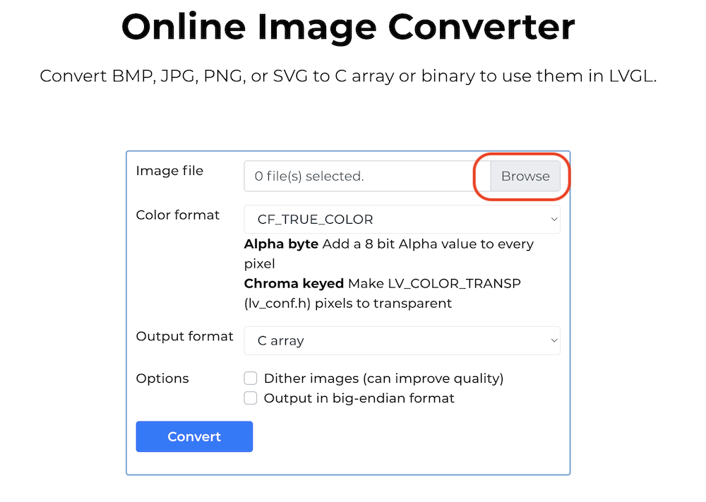
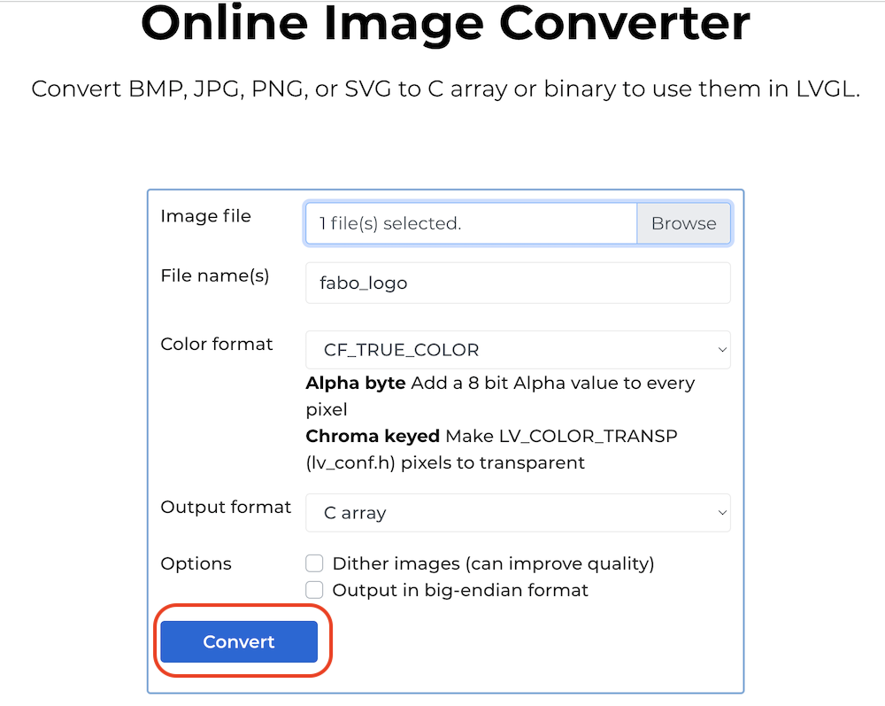
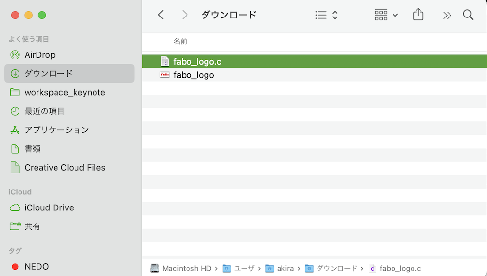

# 画面の切替

## ファイル

|No|作成するファイル名|
|:--|:--|
|1| Image.ino |
|2| fabo_logo.c |
|3| pin_config.h |

## 画像データの変換

画像データは`fabo_logo.png`を<a href="https://lvgl.io/tools/imageconverter" target="_new">lgvlのonline image converter</a>で、Cファイルに変換します。

使用するイメージ


上記イメージの上で、右クリックを押して出現するシュートカットメニューで、`[名前をつけて画像を保存]` を選択し画像をローカルのPCにダウンロードします。

<a href="https://lvgl.io/tools/imageconverter" target="_new">lgvlのonline image converter</a>のページに接続し、ダウンロードしたfabo_logo.pngをonline image converterで変換し、fabo_logo.c がローカルのPCにダウンロードされます。Image.inoとpin_config.hと同じフォルダに保存します。







Arduino IDEの標準コンパイラは、特定のC99特性をサポートていないためfabo_logo.cの一番最後の箇所を下記のように書き直します。

元のソース

```c
const lv_img_dsc_t fabo_logo = {
  .header.cf = LV_IMG_CF_TRUE_COLOR,
  .header.always_zero = 0,
  .header.reserved = 0,
  .header.w = 320,
  .header.h = 167,
  .data_size = 53440 * LV_COLOR_SIZE / 8,
  .data = fabo_logo_map,
};
```

変換後のソース

```c
const lv_img_dsc_t fabo_logo = {
  LV_IMG_CF_TRUE_COLOR,    // header.cf
  0,                       // header.always_zero
  0,                       // header.reserved
  320,                     // header.w
  167,                     // header.h
  53440 * LV_COLOR_SIZE / 8, // data_size
  fabo_logo_map            // data
};
```

変換は、ChatGPTに依頼するとスムーズにいきます。

<a href="https://chat.openai.com/share/ccd5dce1-ae13-435e-b999-7df8cf839c35" target="_new">ChatGPTへの依頼例</a>


## ソースコード

`Image.ino`

```c hl_lines="8 18 121-123"
#include "Arduino.h"
#include "lvgl.h"
#include "esp_lcd_panel_io.h"
#include "esp_lcd_panel_ops.h"
#include "esp_lcd_panel_vendor.h"
#include "pin_config.h"
#include "esp_sntp.h"
#include "fabo_logo.c"

// グローバル変数
esp_lcd_panel_io_handle_t io_handle = NULL;
static lv_disp_draw_buf_t disp_buf;
static lv_disp_drv_t disp_drv;
static lv_color_t *lv_disp_buf;
static bool is_initialized_lvgl = false;
lv_style_t log_style;
lv_obj_t *log_label;
lv_obj_t *img_fabo;
int i = 0;

/**
 * LVGLがデータのフラッシュの準備ができたときに通知
 */
static bool example_notify_lvgl_flush_ready(esp_lcd_panel_io_handle_t panel_io, esp_lcd_panel_io_event_data_t *edata, void *user_ctx) {
    // LVGLの初期化が完了していれば
    if (is_initialized_lvgl) {
        lv_disp_drv_t *disp_driver = (lv_disp_drv_t *)user_ctx;
        lv_disp_flush_ready(disp_driver);
    }
    return false;
}

/**
 * LVGLのデータをLCDにフラッシュするコールバック関数
 */
static void example_lvgl_flush_cb(lv_disp_drv_t *drv, const lv_area_t *area, lv_color_t *color_map) {
    esp_lcd_panel_handle_t panel_handle = (esp_lcd_panel_handle_t)drv->user_data;
    int offsetx1 = area->x1;
    int offsetx2 = area->x2;
    int offsety1 = area->y1;
    int offsety2 = area->y2;
    esp_lcd_panel_draw_bitmap(panel_handle, offsetx1, offsety1, offsetx2 + 1, offsety2 + 1, color_map);
}

void setup() {
    // 電源オンの設定
    pinMode(PIN_POWER_ON, OUTPUT);
    digitalWrite(PIN_POWER_ON, HIGH);

    // LCDの設定: LCDのReadピンをHighに設定
    pinMode(PIN_LCD_RD, OUTPUT);
    digitalWrite(PIN_LCD_RD, HIGH);

    // LCDバスの初期化設定
    esp_lcd_i80_bus_handle_t i80_bus = NULL;
    esp_lcd_i80_bus_config_t bus_config = {
        .dc_gpio_num = PIN_LCD_DC,
        .wr_gpio_num = PIN_LCD_WR,
        .clk_src = LCD_CLK_SRC_PLL160M,
        .data_gpio_nums = {
            PIN_LCD_D0, PIN_LCD_D1, PIN_LCD_D2, PIN_LCD_D3, PIN_LCD_D4, PIN_LCD_D5, PIN_LCD_D6, PIN_LCD_D7
        },
        .bus_width = 8,
        .max_transfer_bytes = LVGL_LCD_BUF_SIZE * sizeof(uint16_t),
        .psram_trans_align = 0,
        .sram_trans_align = 0
    };

    // LCDバスとIOの作成と初期化
    esp_lcd_new_i80_bus(&bus_config, &i80_bus);
    esp_lcd_panel_io_i80_config_t io_config = {
        .cs_gpio_num = PIN_LCD_CS,
        .pclk_hz = EXAMPLE_LCD_PIXEL_CLOCK_HZ,
        .trans_queue_depth = 20,
        .on_color_trans_done = example_notify_lvgl_flush_ready,
        .user_ctx = &disp_drv,
        .lcd_cmd_bits = 8,
        .lcd_param_bits = 8,
        .dc_levels = { .dc_idle_level = 0, .dc_cmd_level = 0, .dc_dummy_level = 0, .dc_data_level = 1 }
    };
    ESP_ERROR_CHECK(esp_lcd_new_panel_io_i80(i80_bus, &io_config, &io_handle));
    
    // LCDパネルの初期化と設定
    esp_lcd_panel_handle_t panel_handle = NULL;
    esp_lcd_panel_dev_config_t panel_config = {
        .reset_gpio_num = PIN_LCD_RES,
        .color_space = ESP_LCD_COLOR_SPACE_RGB,
        .bits_per_pixel = 16,
        .vendor_config = NULL
    };
    esp_lcd_new_panel_st7789(io_handle, &panel_config, &panel_handle);
    esp_lcd_panel_reset(panel_handle);
    esp_lcd_panel_init(panel_handle);
    esp_lcd_panel_invert_color(panel_handle, true);
    esp_lcd_panel_swap_xy(panel_handle, true);
    esp_lcd_panel_mirror(panel_handle, false, true);
    esp_lcd_panel_set_gap(panel_handle, 0, 35);

    // 画面を徐々に点灯させる
    ledcSetup(0, 10000, 8);
    ledcAttachPin(PIN_LCD_BL, 0);
    for (uint8_t i = 0; i < 0xFF; i++) {
        ledcWrite(0, i);
        delay(2);
    }

    // LVGLグラフィックライブラリの初期化
    lv_init();
    lv_disp_buf = (lv_color_t *)heap_caps_malloc(LVGL_LCD_BUF_SIZE * sizeof(lv_color_t), MALLOC_CAP_DMA | MALLOC_CAP_INTERNAL);
    lv_disp_draw_buf_init(&disp_buf, lv_disp_buf, NULL, LVGL_LCD_BUF_SIZE);
    lv_disp_drv_init(&disp_drv);
    disp_drv.hor_res = EXAMPLE_LCD_H_RES;
    disp_drv.ver_res = EXAMPLE_LCD_V_RES;
    disp_drv.flush_cb = example_lvgl_flush_cb;
    disp_drv.draw_buf = &disp_buf;
    disp_drv.user_data = panel_handle;
    lv_disp_drv_register(&disp_drv);
    is_initialized_lvgl = true;

    // 画像オブジェクトの作成と設定
    img_fabo = lv_img_create(lv_scr_act()); // 画像オブジェクトの作成
    lv_img_set_src(img_fabo, &fabo_logo); // 画像データの設定
    lv_obj_align(img_fabo, LV_ALIGN_CENTER, 0, 0); // 画像を画面中央に配置
    
    // LVGLのラベルを作成し、ディスプレイにスタイルを追加
    log_label = lv_label_create(lv_scr_act());
    lv_style_init(&log_style);
    lv_style_set_text_color(&log_style, lv_color_hex(0xFF10F0));
    lv_obj_add_style(log_label, &log_style, LV_PART_MAIN);
    lv_obj_align(log_label, LV_ALIGN_TOP_LEFT, 0, 0);
    lv_obj_set_width(log_label, LV_PCT(100));
    lv_label_set_long_mode(log_label, LV_LABEL_LONG_SCROLL);
    lv_label_set_recolor(log_label, true);
    lv_label_set_text(log_label, "");
}

void loop() {   
    i++;
    lv_timer_handler();
    String msg = "Hello World\n" + String(i);
    lv_label_set_text(log_label, msg.c_str());
    delay(100);
}
```

`pin_config.h`

```c
#pragma once

/* LCDの設定 */
// ピクセルクロックが低すぎるまたは高すぎると、画面がモザイク状になる可能性があります
#define EXAMPLE_LCD_PIXEL_CLOCK_HZ   (16 * 1000 * 1000) // LCDのピクセルクロックの周波数
// 横方向と縦方向のピクセル数
#define EXAMPLE_LCD_H_RES            320  // 横方向の解像度
#define EXAMPLE_LCD_V_RES            170  // 縦方向の解像度
#define LVGL_LCD_BUF_SIZE            (EXAMPLE_LCD_H_RES * EXAMPLE_LCD_V_RES) // LVGL用のLCDバッファサイズ
#define EXAMPLE_PSRAM_DATA_ALIGNMENT 64   // PSRAMデータのアラインメント

/* ESP32S3のピン設定 */
#define PIN_LCD_BL                   38  // LCDのバックライトピン

// LCDデータピン
#define PIN_LCD_D0                   39
#define PIN_LCD_D1                   40
#define PIN_LCD_D2                   41
#define PIN_LCD_D3                   42
#define PIN_LCD_D4                   45
#define PIN_LCD_D5                   46
#define PIN_LCD_D6                   47
#define PIN_LCD_D7                   48

#define PIN_POWER_ON                 15  // 電源オンピン

// LCD制御ピン
#define PIN_LCD_RES                  5   // リセットピン
#define PIN_LCD_CS                   6   // チップ選択ピン
#define PIN_LCD_DC                   7   // データ/コマンド選択ピン
#define PIN_LCD_WR                   8   // 書き込みピン
#define PIN_LCD_RD                   9   // 読み取りピン

// ボタンピン
#define PIN_BUTTON_1                 0
#define PIN_BUTTON_2                 14
#define PIN_BAT_VOLT                 4   // バッテリー電圧ピン

// I2Cピン
#define PIN_IIC_SCL                  17  // I2Cクロックピン
#define PIN_IIC_SDA                  18  // I2Cデータピン

// タッチスクリーンピン
#define PIN_TOUCH_INT                16  // タッチの割り込みピン
#define PIN_TOUCH_RES                21  // タッチのリセットピン

/* 外部拡張 */
// SDカードピン
#define PIN_SD_CMD                   13  // コマンドピン
#define PIN_SD_CLK                   11  // クロックピン
#define PIN_SD_D0                    12  // データピン0
```