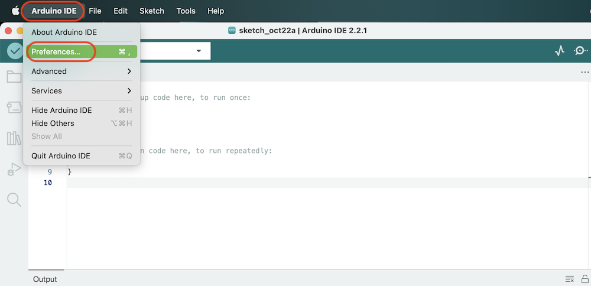
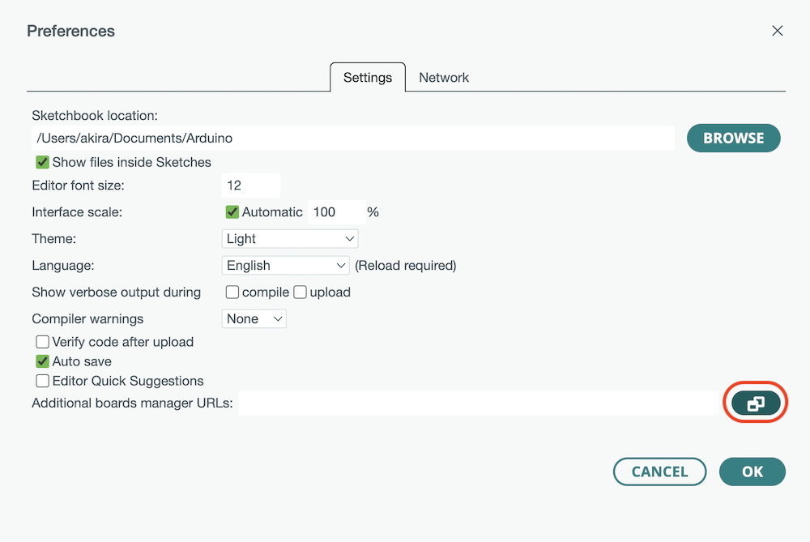
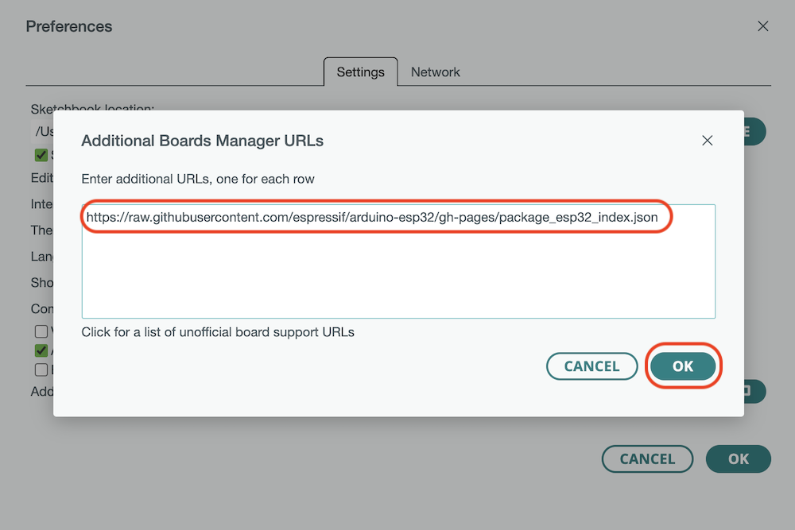
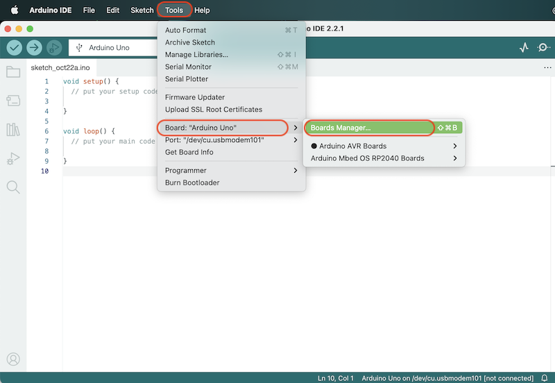
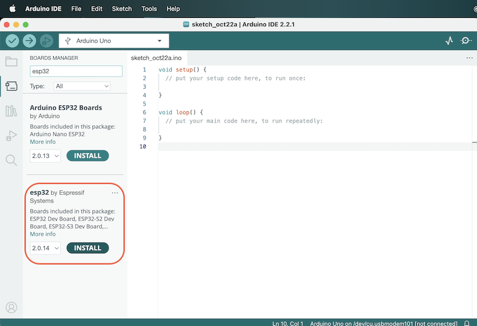
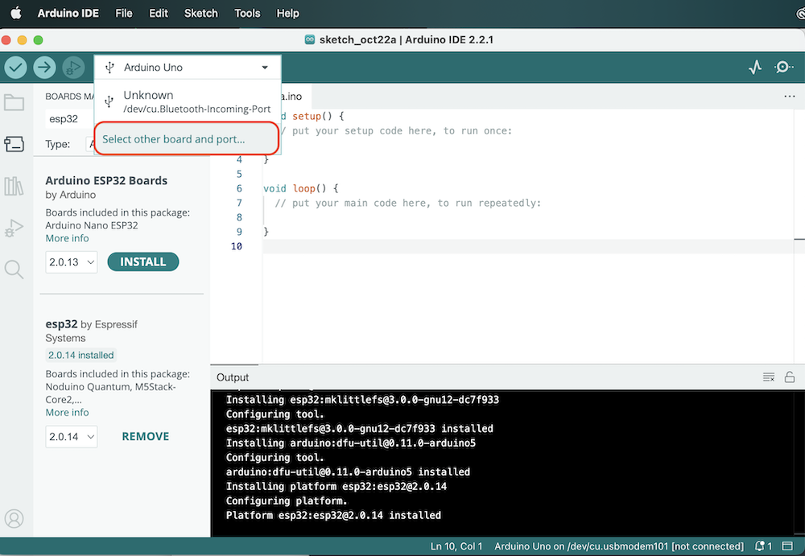
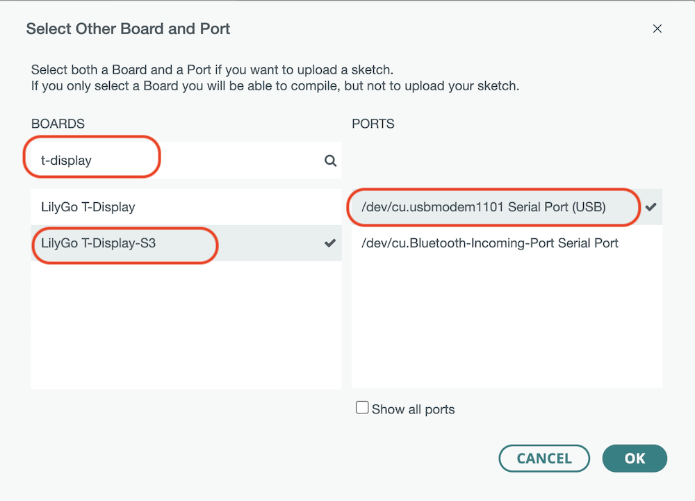
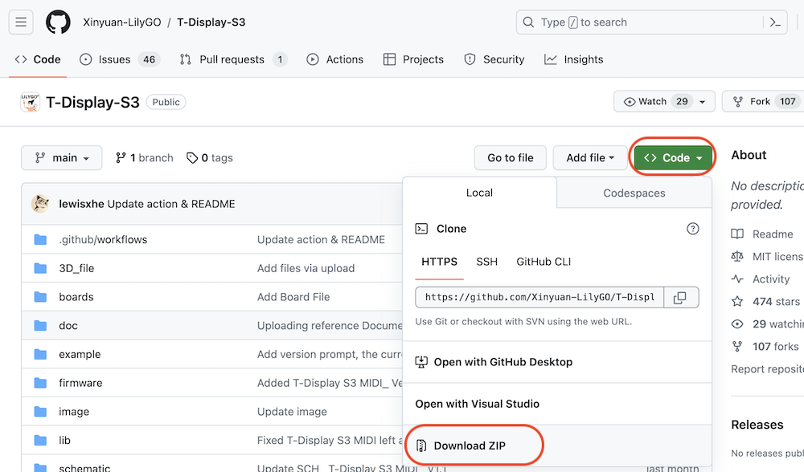
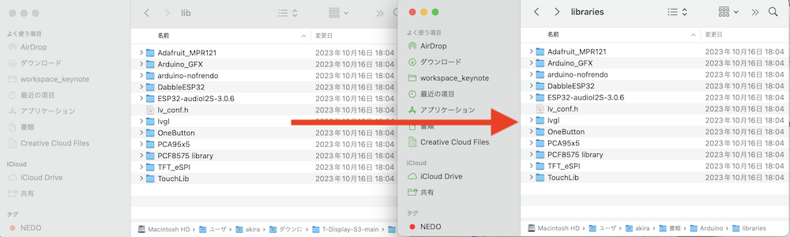

# 設定

## Arduino IDEのボードの追加

Arduino 2.x系を前提に解説していきます。

Arduino IDEを起動し、メニューから`[Arduino IDE]>[Preference]`を選択します。

esp32のボードが追加できるように下記パッケージをコピー&ペーストします。

    https://raw.githubusercontent.com/espressif/arduino-esp32/gh-pages/package_esp32_index.json

Arduino IDEのメニューから`[Tool]>[Board]>[Board manager]`を選択します。

`esp32 by Espressif system`を選択します。

Boardの設定をおこないます。

`T-Display S3`とUSB Type-Cとデバイスの接続ポートを選択します。

## Arduinoライブラリの追加

[https://github.com/Xinyuan-LilyGO/T-Display-S3](https://github.com/Xinyuan-LilyGO/T-Display-S3)より、パッケージをDownloadしてきます。

パッケージの解凍し、libフォルダのライブラリ一式を、`C:\Users\YourName\Documents\Arduino\libraries` にコピーします。

